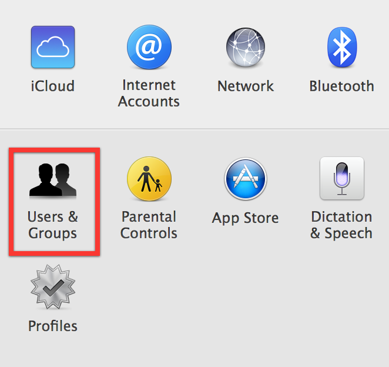
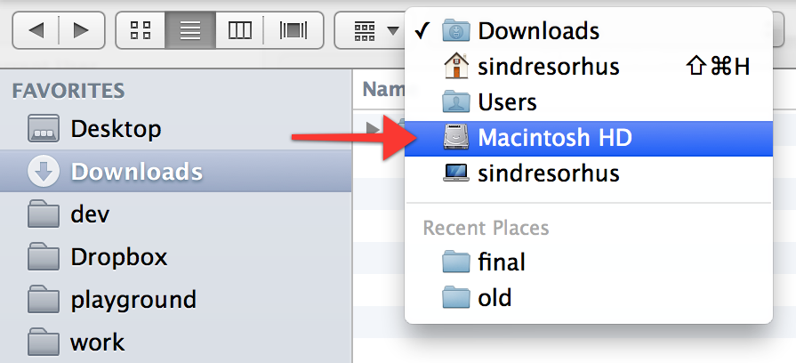
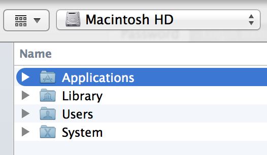

# Launch app on startup

> How to have an macOS app launched on startup

### Open `System Preferences`

### Click `Users & Groups`

### Click the `Login Items` tab and then the `+` button

### Go to the `Applications` folder

### Select the app you want to start at login and click `Add`

