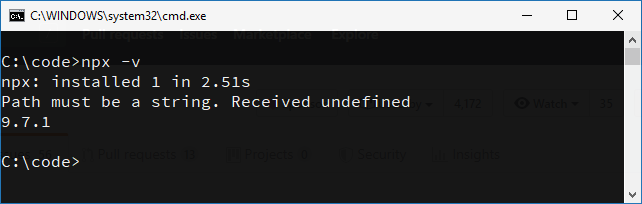
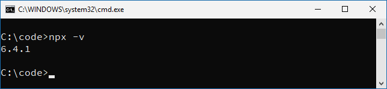

# Run NPX without errors on Windows

Rearranging the `PATH` environment variable on Windows fixes common problems with **older versions** of NPX.

> TL;DR: Put your **NPM** folder *before* the **NodeJS** installation folder in your `PATH` environment variable.

Example of a recurring problem with NPX (see [#144](https://github.com/zkat/npx/issues/144), [#148](https://github.com/zkat/npx/issues/148), [#168](https://github.com/zkat/npx/issues/168) for instance), where it shows two messages every time we run it:



Both "`npm: installed 1 in 2.51s`" and "`Path must be a string. Receive undefined`" appeared because they are affected by the order in which NPM and NodeJS are declared in the `PATH` variable.

#### Solution

Adjust the `PATH` environment variable to declare the NPM folder *before* the NodeJS folder. For instance:

```
...
%APPDATA%\npm
C:\Program Files\nodejs\
...
```

Now it's fixed:




**Note**: If you are using NVM for Windows, you may also have to rearrange `%NVM_HOME%` and `%NVM_SYMLINK%` so that `%NVM_SYMLINK%` appears before `%NVM_HOME%`.